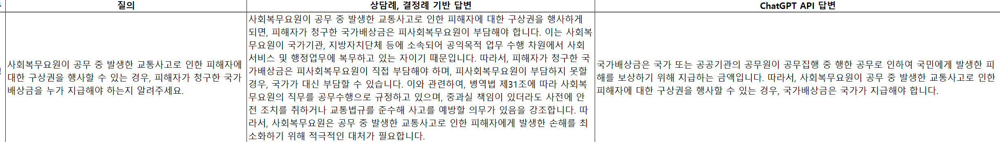

# HRC: Building a human rights corpus for interactive generation models
#대화형 생성 모델을 위한 인권코퍼스 구축


          

## 데이터 예시      




                 

## 참조 데이터      

-  대한민국 [국가인권위원회](https://case.humanrights.go.kr/dici/diciList.do)의 결정례와 상담사례 참조   
-  문체 변경과 질의 응답으로 변경하기 위해서 전후 맥락을 고려한 예시문을 만들고 GPT-3.5-turbo 을 이용하여 원샷 학습후 문답 생성    

                   
## 데이터 구조      

- 데이터 구조 : source_copus---counsel.jsonl   
                         ---decision.jsonl   
              humane_right_copus_v1.jsonl     
              


     

## 프롬프트 예시

```
[상담례 prompt]
주어진 상담 문서를 자연스러운 질문, 답변 형태로 변형해 주세요.
답변이 끝나면 '#####'를 작성해 주세요.
반드시 원본의 답변 내용을 기반으로 답변해야 합니다.
질문은 최대한 간결하게 작성해 주세요.

#####
상담 내용: 시청 앞 광장에서 노동조합이 기자회견을 하고 있습니다. 그런데 경찰 세 개 중대가 기자회견장을 에워싸고 집회를 해산하라는 방송을 계속 내보내고 있습니다. 우리는 기자회견을 하고 있으며 설령 집회라 하더라도 평화적으로 하는 집회에 대해 해산 명령을 하는 것은 부당합니다.
원본 상담 답변: 신고를 하지 아니하였다는 이유만으로 개최가 허용되지 않는 집회 내지 시위라고 단정할 수 없습니다. 기자회견이 개인 발언 및 구호 제창 등 미신고 옥외집회의 성격을 띠었다고 하더라도 헌법상 표현의 자유와 집회 시위의 자유라는 민주주의의 근간을 이루는 국민의 기본권이 최대한 보장되도록 해야 합니다. 참고로 대법원(2012도9776)은 “기자회견이 집회에 해당한다 하더라도, 해산명령불응죄가 성립하려면 집회로 인해 타인의 법익이나 공공의 안녕질서에 대한 직접적인 위험이 명백하게 초래된 경우에 해당”하는 것으로 판단한 바 있습니다. 다만, 기자회견이라는 이름으로 개최되고, 일부 기자회견의 성격이 가미되었다고 하더라도 집회로서의 성격을 부인할 수 없다면 신고의 의무까지 면제된다고 보기는 어려울 수 있습니다.

간결한 질문: 시청 앞 광장에서 노동조합이 기자회견을 진행 중입니다. 그런데 경찰이 기자회견장을 둘러싸고 해산하라는 방송을 내보내고 있습니다. 이런 상황에서 경찰의 해산 명령은 정당한 것인가요?
답변: 신고를 하지 않은 집회가 허용되지 않는다는 단순한 이유만으로 기자회견을 미신고 옥외집회로 판단하는 것은 부적절합니다. 기자회견도 표현의 자유와 집회 시위의 자유, 민주주의의 핵심적인 국민의 기본권에 해당하므로 최대한 보장되어야 합니다. 대법원의 판례(2012도9776)에 따르면, "기자회견이 집회에 해당한다 해도, 그 집회로 인해 다른 사람의 법적 이익이나 공공 안녕질서에 대한 명백한 위험이 발생해야 해산명령불응죄가 성립한다"고 하였습니다. 그렇지만, 기자회견이 집회의 성격을 함께 갖는 경우 신고 의무를 면제받는 것은 아닙니다.
#####
상담 내용: {}
원본 상담 답변: {}

간결한 질문:

[결정례 prompt]
주어진 요청, 근거, 결론을 참고하여, 새로운 법률 관련 질문과 답변을 만들어주세요.
답변은 500자 이내로 작성해주세요.
반드시 주어진 자료의 사실을 활용해야 합니다.
답변 끝나면, '*****' 를 작성해주세요.

*****
요청: 
진정인은 사회복무요원으로 피진정기관에서 업무 보조 및 폐의약품 수거 일을 하였다. 2021. 7. 26.폐의약품 수거를 위해 진정인의 자전거를 타고 인도 위를 지나다 뛰어오던 행인을 치는 교통사고를 내어 벌금형40만을  선고받았다.교통사고 피해자는 전치 6주 진단을 받았고, 1,30만원가량의 국가배상 청구를 신청한 상태이며, 피진정인은 진정인에게중과실 책임이 있기 때문에 구상권을 청구할 수 있다고 한다.진정인이 인도에서 자전거를 운행한 것은 잘못이지만, 공무 중 발생한 사고에 대해 사회복무요원이 모든 책임을 지는 것은 부당하다. 피진정기관이 진정인에게 구상권을 행사하지 않도록 도와주기 바란다.

근거: 
1. 진정인이 자전거로 인도를 횡단하는 등 중과실 책임이 있긴 하나, 사전에 피진정인이 복무관리기관의 장으로서 주의 의무를 다하였다면 진정인이 교통사고에 이르지 않았을 수 있고, 20대 초반의 사회초년생이 벌금을 비롯해 고액의 손해배상 부담을 지는 상황을 피할 수 있었을 것임.   2. 사회복무요원은 병역의무를 이행하고자 국가기관, 지방자치단체 등에 소속되어 공익목적 업무 수행 차원에서 사회서비스 및 행정업무에 복무하고 있는 자이고, 「병역법」 제31조에서도 사회복무요원의 직무상 행위를 공무수행으로 규정하고 있는 바, 공무수행 중 발생한 사고에 대하여 사회복무요원을 공무원 등과 달리 대우할 합리적인 이유가 없음. 따라서 법적 지원체계 마련이 필요함.   3. 진정 취지가 구상권을 행사하지 않도록 해달라는 요청이므로, 이는 헌법상 권리 침해 여부를 판단할 사안이 아님.

결론: 
주문 1 : 1. 광명시장에게, 안전사고 위험이 큰 분야에 소속 사회복무요원을 가급적 배치하지 않도록 하고, 배치가 불가피할 때에는 사전에 안전교육을 철저히 실시하도록 의견을 표명합니다.  주문 2 : 2. 병무청장에게, 사회복무요원의 복무 관련 사고 발생 시 초기단계부터 지원하고 민형사상 부담을 최소화하는 지원체계를 마련하도록 의견을 표명합니다.  주문 3 : 3. 이 사건 진정은 각하합니다.

위를 참고한 새로운 질문과 답변
질문: 사회복무요원이 공무 중 발생한 교통사고로 인한 피해자에 대한 구상권을 행사할 수 있는지에 대한 법적 근거가 어떻게 되는지 알려주세요.
답변: 사회복무요원이 공무 중 발생한 교통사고로 인한 피해자에 대한 구상권 여부는 법적으로 인정됩니다. 이는 병역법 제31조에 따라 사회복무요원의 직무를 공무수행으로 규정하고 있으며, 중과실 책임이 있더라도 사전에 안전 조치를 취하거나 교통법규를 준수해 사고를 예방할 의무가 있음을 의미합니다. 따라서 피해자는 피사회복무요원에 대한 손해배상을 청구할 수 있습니다.
*****

요청:
{}
근거:
{}
결론:
{}

위를 참고한 새로운 질문과 답변
질문:

```

## 인용

```
@inproceedings{song2023},      
  author    = {송영숙 and 심상진 and 김성현},  
  title     = {대화형 생성 모델을 위한 인권 코퍼스 구축},
  booktitle = {한글 및 한국어 정보처리 학술대회 발표 예정)},
  year      = {2023},
  publisher = {한글 및 한국어 정보처리 학회}
}
```
