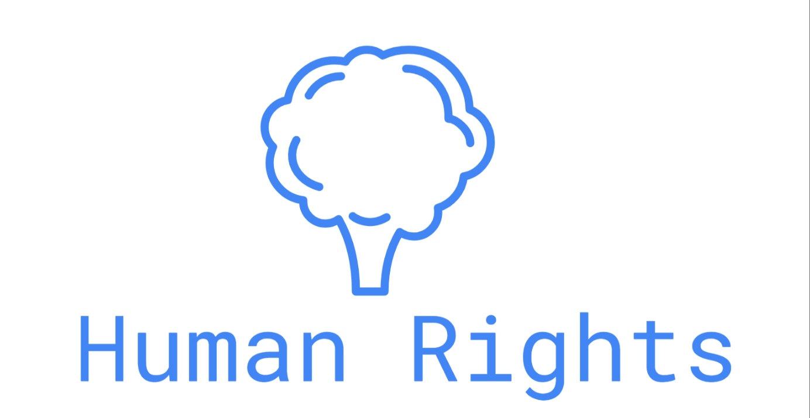

# HRC: Building a human rights corpus for interactive generation models
#대화형 생성 모델을 위한 인권코퍼스 구축

데이터 구축 과정

-  대한민국 [국가인권위원회](https://case.humanrights.go.kr/dici/diciList.do)의 결정례와 상담사례를 참조
-  문체 변경과 질의 응답으로 변경하기 위해서 전후 맥락을 고려한 예시문을 만들고  GPT4모델을 이용하여 원샷 학습후 문답을 생성
-  학습 이전 답변과 이후 답변 세트 비교 분석
-  대화형 생성 모델이 실제 세계에서 자주 발생하는 인권 관련 답변의 실제성을 높이자는 목적에서 구축되었음

  
